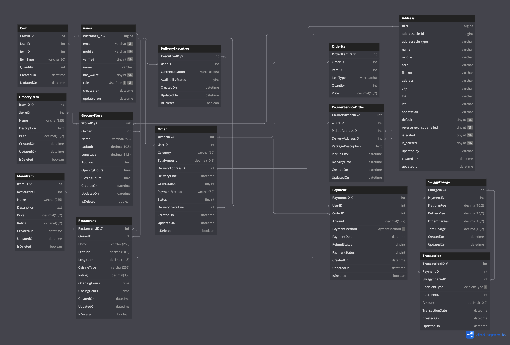

# Product Dissection for Swiggy

[_Rakshit Pandey_](https://www.linkedin.com/in/pandey-rakshit)

**Company Overview:**

Swiggy, a well-known Indian online food ordering and delivery platform, was founded in August 2014 by Sriharsha Majety, Nandan Reddy, and Rahul Jaimini. Headquartered in Bangalore, Karnataka, Swiggy has rapidly expanded its services to cover over 580 cities across India as of July 2023. It operates as an online platform connecting customers with a wide range of restaurants and eateries, offering convenient and reliable food delivery services.

Before Swiggy, both customers and restaurants faced significant challenges. Restaurants often didn't offer home delivery, leading to problems for people who couldn't commute or spend time dining out due to their busy schedules. Customers were limited to nearby restaurants with limited menus, resulting in restricted dining choices. Traditional ordering processes were cumbersome, involving phone calls, potential miscommunications, and long waiting times. These challenges were particularly problematic for corporate employees who barely had time to cook and needed quick, proper meals.

Swiggy emerged as a bridge to remove these hurdles, connecting nearby restaurants with customers and making food delivery easy and efficient.

---

### **Core Services:**

1. **Food Delivery:** Swiggy allows customers to order food from a vast network of restaurants through its website and mobile app.

2. **Grocery Delivery:** Under the brand Instamart, Swiggy offers on-demand delivery of groceries and essential items.

3. **Courier Service:** Swiggy Genie provides same-day package delivery, catering to various logistical needs.

---

### **Top Features of Swiggy**

1. **Extensive Restaurant Network:** Swiggy partners with a vast network of local and national restaurants, offering a diverse range of cuisines and dining options. This extensive network ensures that customers have access to a wide variety of food choices, catering to different tastes and preferences, and enhancing user satisfaction.

2. **User-Friendly Interface:** Customers can browse restaurants, view menus, and place orders conveniently via Swiggy's intuitive web and mobile interfaces. The platform's user-centric design includes features such as detailed menus, user reviews, and personalized recommendations, ensuring a seamless ordering experience.

3. **Real-Time Order Tracking:** Swiggy provides real-time tracking of orders from placement to delivery. Customers can monitor their order status, track the delivery executive's location, and receive timely updates. This transparency enhances trust and reliability, ensuring a smooth and predictable delivery experience.

4. **Multiple Payment Options:** Swiggy supports various payment methods, including credit/debit cards, digital wallets, and UPI. This flexibility in payment options ensures secure transactions and accommodates diverse customer preferences, making the payment process seamless and convenient.

5. **Efficient Delivery Network:** Swiggy's robust delivery network, managed by dedicated delivery executives, ensures prompt and efficient order fulfillment. Collaborating with a network of delivery partners, Swiggy optimizes delivery routes using GPS technology, minimizing delivery times and enhancing service efficiency.

6. **Customer Support:** Swiggy offers comprehensive customer support through various channels, including in-app chat, email, and a dedicated helpline. Trained support agents promptly assist customers with order-related inquiries, payment issues, and feedback, ensuring a positive customer experience. The availability of reliable customer support contributes to Swiggy's reputation for responsive service and customer satisfaction.

---

### **Business Model:**

Swiggy generates revenue primarily through commissions from restaurants and delivery fees. It also offers subscription-based services and partnerships with various businesses.

---

### **Market Position:**

Swiggy competes with other major players in the food delivery and hyperlocal marketplace sectors, such as Zomato, offering extensive geographical coverage and diverse service options.

---

## **Case Study: Real-World Problems and Swiggy's Innovative Solutions**

**Background:** Swiggy's entry into the market addressed several challenges faced by customers and restaurants alike, transforming the food delivery landscape in India.

**Key Features:**

1. **Problem 1: Limited Restaurant Choices**

   - **Real-World Challenge:** Before Swiggy, customers were often limited to nearby restaurants with limited menus, restricting their dining choices.
   - **Swiggy's Solution:** Swiggy partnered with a vast network of restaurants, ranging from local eateries to popular chains, offering customers a wide variety of cuisines and menu options. This expanded choice and accessibility through a single platform.

2. **Problem 2: Inconvenient Ordering Process**

   - **Real-World Challenge:** Traditional food ordering involved phone calls, menu browsing, and potential miscommunications, leading to order errors and delays.
   - **Swiggy's Solution:** Swiggy introduced a user-friendly app and website where customers can browse restaurant menus, read reviews, and place orders seamlessly. This streamlined process eliminated traditional ordering hassles.

3. **Problem 3: Lack of Transparency in Delivery**

   - **Real-World Challenge:** Customers lacked visibility into the status of their food deliveries, often relying on estimated times that were not always accurate.
   - **Swiggy's Solution:** Swiggy implemented real-time order tracking, allowing customers to monitor their orders from placement to delivery. This enhanced transparency and reliability in the delivery process.

4. **Problem 4: Payment Hassles**

   - **Real-World Challenge:** Before Swiggy, limited payment options and separate transactions for deliveries caused inconvenience to customers.
   - **Swiggy's Solution:** Swiggy integrated multiple payment methods, including credit/debit cards, digital wallets, and UPI, into its platform. This enabled seamless and secure transactions directly through the app.

5. **Problem 5: Delivery Reliability**
   - **Real-World Challenge:** Reliability in food delivery, including accurate timings and order completeness, varied across traditional services.
   - **Swiggy's Solution:** Swiggy ensured delivery reliability by partnering with dedicated delivery executives and implementing GPS-enabled tracking for optimized routing. This improved service consistency and customer satisfaction.

---

**Database Schema**

Swiggy's platform relies on a robust database schema to manage its complex operations, ensuring efficient data handling and seamless service delivery. Here is an overview of the key entities and their attributes:

---

---

**ER Diagram:**

1. **Users place Orders (One-to-Many Relationship):** Each user can place multiple orders, but each order belongs to a single user.

2. **Restaurants offer Menu Items (One-to-Many Relationship):** Each restaurant can offer multiple menu items, but each item belongs to a single restaurant.

3. **Orders include Order Items (One-to-Many Relationship):** Each order can include multiple items, and each item can be part of multiple orders.

4. **Orders have Payments (One-to-Many Relationship):** Swiggy allows users to retry payment with different methods (e.g., cards, wallets) if initial attempts fail, ensuring seamless order processing and transaction reliability.

5. **Delivery Persons handle Orders Deliveries (One-to-Many Relationship):** Each delivery executive oversees multiple delivery assignments, ensuring efficient order fulfillment across Swiggy's network.

---

**Implementation and Impact:**

**Implementation:** Swiggy implemented these features by leveraging technology for seamless user interactions, forging partnerships with restaurants for menu integration, and training delivery executives for efficient service.

**Impact:** These innovations enhanced customer convenience, expanded restaurant reach, improved delivery transparency, ensured payment security, and optimized delivery reliability. Swiggy's impact on the food delivery industry set new standards and solidified its position as a market leader in India.

---

**Conclusion:**

Swiggy's success lies in its ability to address real-world problems through innovative solutions. By expanding restaurant choices, simplifying the ordering process, enhancing delivery transparency, integrating various payment options, and ensuring delivery reliability, Swiggy has transformed the food delivery landscape in India. Its robust database schema and well-defined entity relationships underpin the seamless functionality of its platform, contributing to its widespread popularity and continued growth.
